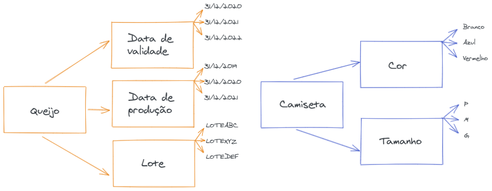
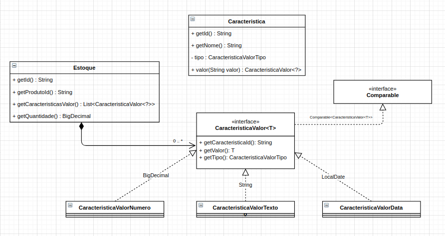

# CONSTRUÇÃO DE OBJETOS


## Contextualização

O encapsulamento das regras de negócio referente ao nascimento de um novo objeto muitas vezes escapam de onde deveriam estar e acabam vazando a responsabilidade para camadas superiores/clientes.

## Exemplo

Para ilustrar a situação, trouxemos uma simplificação de um cenário real de controle de estoque. O cenário consiste da necessidade de controlar estoques de produtos que possuem diferentes características. Estas características podem ser "coisas" mais comumns como lote, data de validação, data de  fabricação bem como cor, tamanho ou alguma outra característica não tão comum. O controle de estoque consiste em permitir buscar no estoque, produtos com valores de características específicos para características específicas bem como ordenar/priorizar os estoques pelos valores de suas características. Exemplo, buscar os estoques de queijo com data de validade até 31/12/2020 ordenados pela data de validade. Queijos podem possuir características como lote, data de validade e data de fabricação, enquanto camisetas, outro tipo de produto, podem ter outras características como cor e tamanho.





Para atender as necessidades apresentadas, considere a existência de um cadastro de possíveis características e que estas características são associadas ao produto no momento da entrada no estoque. Para que os filtros e a ordenação do estoque aconteça da forma correta, o tipo de dado de cada característica é muito importante. Ordenar uma data como data é completamente diferente de ordenar como um número ou como um texto. Sendo assim, cada característica tem a indicação do tipo de dado referente ao seu valor, podendo ser um texto, número, data e até mesmo outros tipos. Este dinamismo do tipo de dado pode acarretar em complexidade técnica para tratar cada tipo de dado. 
Considerando todo o cenário apresentado, o exemplo aqui apresentado tem o objetivo de resolver dois pontos:
* Tornar a construção do objeto transparente independente do tipo de valor;
* Tornar a ordenação das informações do estoque independente do tipo de valor;


 


Mas onde entra o enum factory e como ele pode ajudar?

```java
public enum CaracteristicaValorTipo {
	TEXTO {

		@Override
		public CaracteristicaValorTexto createInstance(String id, String valor) {
			return new CaracteristicaValorTexto(id, valor);
		}

	},

	NUMERO {

		@Override
		public CaracteristicaValorNumero createInstance(String id, String valor) {
			return new CaracteristicaValorNumero(id, new BigDecimal(valor));
		}

	},

	DATA {

		@Override
		public CaracteristicaValorData createInstance(String id, String valor) {
			return new CaracteristicaValorData(id, LocalDate.parse(valor));
		}

	};

	public abstract CaracteristicaValor<?> createInstance(String id, String valor);
}
```

Tornando a construção transparente através de método fábrica na entidade característica.

```java
public class Caracteristica {
	// ...

	public CaracteristicaValor<?> valor(String valor) {
		return this.getTipoValor().createInstance(this.id, valor);
	}

        // ...
}
```
Utilização do método na criação de um novo estoque.

```java
List<CaracteristicaValor<?>> caracteristicas = List.of(lote.valor("Lote ABC"), dataValidade.valor("2021-12-31"));

Estoque estoque =  Estoque.builder()
                          .id(id)
		          .produtoId(produtoId)
                          .quantidade(quantidade)
                          .caracteristicas(caracteristicas)
                          .build();
```

Tornando a ordenação transparente

  
```java

// ...

estoques.sort(Comparator.comparing(estoque -> estoque.getCaracteristicaValor(algumaCaracteristica.getId())));

// ...

```
